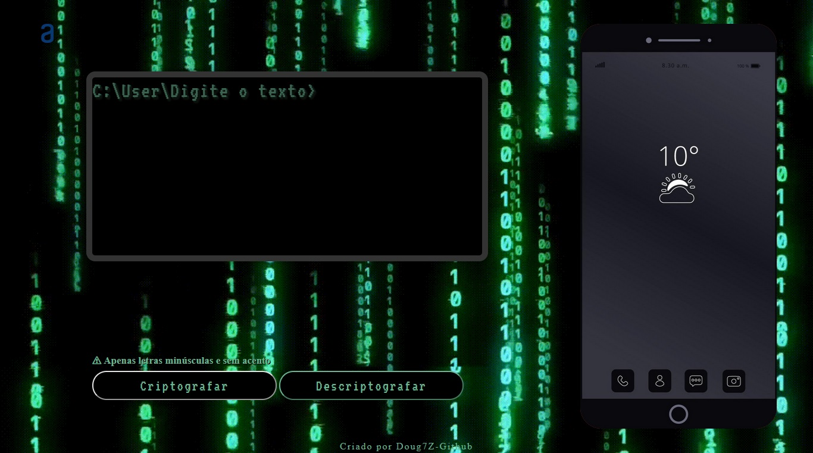

<h1>Decodificador de texto</h1>

<h2>Challenger Oracle One T7 Alura</h2>

<h4>Esta aplicação recebe um texto e o converte de acordo com as regras de criptografia definidas.</h4>
<h4>Em seguida, o texto é descriptografado para gerar o resultado correto.</h4>

<h2>Tecnologias Utilizadas</h2>

Este projeto utiliza as seguintes tecnologias:

<ul>
    <li>HTML</li>
    <li>CSS</li>
    <li>JavaScript</li>
</ul>

